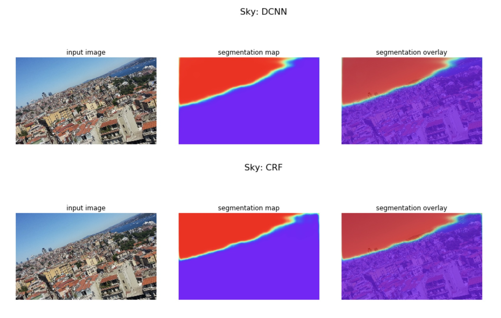

# Horizon Segmentation

Using DeepLabv3 to segment areial images and then extract the horizons.

- Trained with xception65 feature extractor pre-trained on ImageNet.
- CRF postprocessing via DeepCRF

I also wrote a [C++ port](https://github.com/jahewson/tensorflow/blob/97eb6828b9217fcd112d02720c36e8d3a78c2467/tensorflow/cc/iris-challenge/iris-challenge.cc
) of this code.



## Dependencies

Python 3.6

```shell
pip install tensorflow
pip install matplotlib
pip install pillow
pip install scipy
conda install -c conda-forge pydensecrf
```
